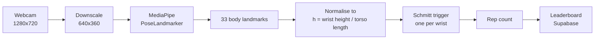
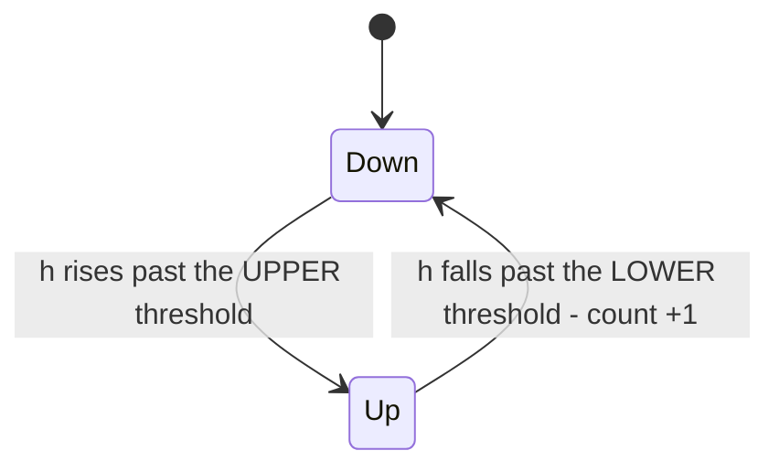

# 67 SPEED

Browser-based webcam speed challenge for the NA Computer & AI Club. The frontend is React + TypeScript + Vite. Pose detection runs locally in the browser with MediaPipe. Supabase stores the shared leaderboard.

Production URL: `https://67.naclubs.net`

## How it works

The whole game is one question: **how do you count arm pumps from a webcam,
fast enough and reliably enough that a stranger trusts the number?**

<!-- Screenshots welcome here - drop PNGs in a docs/ folder and link them. -->

### 1. Pose, not hands

The obvious approach is hand tracking. It does not work. Someone pumping their
arms as hard as they can produces heavy motion blur, and hand landmarkers lose
the hand exactly when the game gets interesting.

Whole-body pose estimation survives blur far better, because it infers joint
positions from the shape of the entire body rather than from fine finger
detail. So the game runs MediaPipe's **PoseLandmarker** (the `lite` model,
float16) and only ever looks at six of its 33 landmarks: two shoulders, two
elbows, two wrists - plus the hips as a size reference.



The camera stays at full resolution for what you see, while inference runs on a
downscaled copy. The model resizes its input to 256x256 internally anyway, so
640x360 costs nothing in accuracy and makes each frame cheaper to hand to the
GPU.

### 2. Turning a body into one number

Raw pixel coordinates are useless: stand closer and every distance doubles. So
each wrist is measured as a **ratio**:

```
h = (shoulder height - wrist height) / torso length
```

`h = 0` means the wrist is level with the shoulder, `h = 1` means it is a full
torso-length above it. Two useful properties fall out of this for free:

- **Scale invariance.** Divide by torso length and it no longer matters whether
  you are one metre from the camera or three.
- **Shake invariance - the anti-cheat.** `h` is a *difference* between two body
  parts. Shake the laptop and the shoulder and the wrist move together, so the
  difference barely changes. Waving the camera around scores you nothing. Only
  moving your arm *relative to your own body* counts.

### 3. Counting without double-counting

A naive "wrist is above the line" test fires dozens of times per pump, because
the signal jitters across the line. The fix is a **Schmitt trigger**: two
thresholds instead of one, with a gap between them.



The rep is counted on the way *down*, so you have to complete the motion. Each
wrist runs its own independent trigger, which is why alternating your arms
scores faster than pumping both together. A 70 ms debounce per wrist rejects
anything faster than a human arm can actually move.

### 4. The thresholds tune themselves

The first version used fixed thresholds, and it was quietly broken. Two
different players got completely different results, and one person's right arm
would refuse to register at all. There were two causes:

- If your shoulders are even slightly tilted, the shoulder *midpoint* sits above
  one shoulder and below the other, pushing the two arms in opposite directions.
- Someone pumping at chest height peaks around `h = 0.2` and never reaches a
  threshold set at `0.35` - so they score zero while feeling like they are
  working hard.

So the thresholds became **relative to each wrist's own recent range of motion**,
measured over a 700 ms sliding window, with the trigger points at 65% and 35% of
that range. Pump small and the window shrinks to match; pump overhead and it
grows. A minimum range requirement keeps someone standing still - or just
gesturing while they talk - from scoring.

The difference, measured against simulated players with known rep counts:

| Player style | Fixed thresholds | Self-calibrating |
| --- | --- | --- |
| Overhead pumping | 100% | 100% |
| Chest-height pumping | **0%** | 100% |
| Small, fast pumps | **0%** | 100% |
| One arm riding low (tilted stance) | **0%** | 100% |
| Getting tired mid-run | 100% | 100% |
| Standing still (false positives) | none | none |

### 5. Tuned by simulation, not by feel

Those window and threshold numbers were not guessed. `npm run tune` generates
synthetic arm-pump signals with **known** rep counts - fast, slow, tiny, tiring,
noisy, dropping out, plus several "player is standing still" cases - and sweeps
the parameters to find the settings with the lowest total error.

Worth noting: the sweep's best-scoring configuration was **not** the one shipped.
It sat at the edge of the search range and collapsed completely on slow pumps,
because its window was too short to contain a full pump cycle. The shipped
settings are the ones that never fall below 97% on *any* scenario. Optimising a
single number is how you get a benchmark score; checking the failure cases is
how you get something that works at a fair.

### 6. Staying at 30+ fps

Inference is synchronous, so the loop never lets work pile up: it refuses to run
twice on the same camera frame, and if a frame takes longer than 40 ms it starts
processing every other one instead of falling behind. Rendering never waits on
React either - the per-frame code writes to refs and draws straight to a canvas,
and React state is published on a throttle.

### 7. Your camera never leaves your device

There is no upload, no recording, and no transmission of video anywhere. The
code contains no frame-export calls at all - no `toDataURL`, no `MediaRecorder`,
no `captureStream` - so frames physically cannot leave the browser. The only
network requests the app makes are the three leaderboard queries.

The leaderboard stores four things, and only if you choose to submit: the name
you type, your score and mode, whether you won a duel, and the timestamp.

### 8. The leaderboard is append-only

The `scores` table can be read and inserted into by the public, and **never
updated or deleted** - there is deliberately no policy granting either. Showing
one row per player is done with a database *view* rather than by letting the
browser overwrite rows, because an update permission that lets you edit your own
score also lets you edit everybody else's.

`npm run check:db -- --write` verifies all of this against the live database,
including that deletes are refused and that a solo run cannot be recorded as a
duel win.

### Where the code lives

| Path | What it does |
| --- | --- |
| `src/lib/pose/tracker.ts` | Camera, MediaPipe setup, the inference loop |
| `src/lib/pose/landmarks.ts` | Turns landmarks into the scale-invariant `h` |
| `src/lib/pose/repCounter.ts` | The self-calibrating trigger - the actual game |
| `src/lib/pose/overlay.ts` | The gold skeleton drawn over the video |
| `src/game/useGame.ts` | Countdown, 20-second clock, pose gating |
| `src/lib/leaderboard.ts` | Supabase reads/writes with an offline fallback |
| `scripts/tuneAuto.ts` | The offline parameter sweep described above |

Press **D** while playing for a live diagnostic panel: frame rate, inference
cost, and a real-time graph of `h` for each wrist with the moving thresholds
drawn over it.

---

## Local development

```bash
npm install
npm run dev
```

Production build:

```bash
npm run build
```

Vite writes the deployable static site to `dist/`.

## Production architecture

- Cloudflare Pages hosts the static frontend at `67.naclubs.net`.
- MediaPipe model and WASM assets are served from the same Pages site.
- Webcam frames and pose inference stay in the user's browser.
- Supabase stores leaderboard entries only.
- No Cloudflare Worker, Pages Function, or inference server is required.

## 1. Create the Supabase backend

Create a dedicated Supabase project for 67 SPEED. Do not reuse an unrelated production project.

After the project is ready:

1. Open **SQL Editor** in Supabase.
2. Open `supabase/schema.sql` from this repository.
3. Run the entire file once.
4. Confirm that `public.scores` exists.
5. In **Settings > API Keys**, copy the **Publishable key** (`sb_publishable_...`). Do not use a secret/service-role key in the browser.
6. Copy the project API URL, which looks like `https://<project-ref>.supabase.co`.

The schema enables RLS and grants the public browser only the permissions required to read and insert leaderboard rows. Browser clients cannot update or delete scores.

## 2. Cloudflare Pages build settings

Create a Pages project from the GitHub repository `Danielw412/NA-ComputerAI-Club`.

Use these settings exactly:

| Setting | Value |
| --- | --- |
| Production branch | `main` |
| Root directory | `67speed` |
| Framework preset | `Vite` |
| Build command | `npm run build` |
| Build output directory | `dist` |
| Node version | `22.16.0` (pinned by `.node-version`) |

Because this repository contains multiple projects, configure **Settings > Build > Build watch paths** after the Pages project is created:

```text
Include paths: 67speed/*
Exclude paths: leave empty
```

That prevents unrelated changes elsewhere in the repository from rebuilding 67 SPEED.

## 3. Add Supabase environment variables

The production deployment requires these Vite build variables:

```text
VITE_SUPABASE_URL=https://<project-ref>.supabase.co
VITE_SUPABASE_PUBLISHABLE_KEY=sb_publishable_...
```

In Cloudflare Pages, open **Settings > Variables and Secrets** and add both values for the production environment. Add the same values to preview deployments while testing the deployment PR.

These are build-time Vite variables. After adding or changing them, trigger a new deployment.

The publishable key is intentionally exposed to the browser. Security comes from Supabase RLS. Never put a Supabase secret key or service-role key in a `VITE_*` variable.

## 4. Test the deployment PR before merging

The Cloudflare deployment changes are prepared on the `cloudflare-pages-67speed` branch. Keep `main` as the Pages production branch.

After Git integration is connected, use the Cloudflare preview deployment for `cloudflare-pages-67speed` / PR #1 to test the final build before merging it. Cloudflare preview deployments do not replace the production deployment.

Verify all of the following on the preview URL:

1. The build completes successfully.
2. The home screen loads with the correct logo and font.
3. Starting a game prompts for camera permission over HTTPS.
4. The camera preview appears after permission is granted.
5. Pose tracking starts without a model or WASM loading error.
6. Solo mode counts repetitions and finishes normally.
7. Duel mode detects two players and keeps separate scores.
8. Submitting a leaderboard score succeeds.
9. Reloading the page still shows the shared Supabase leaderboard entry.
10. The browser console has no 401/403 errors from Supabase.

Only merge PR #1 after the preview passes these checks. Once merged, Cloudflare will automatically rebuild the `main` production deployment.

## 5. Connect `67.naclubs.net`

After the merged `main` deployment passes the same checks on its `*.pages.dev` URL:

1. Open the Pages project in Cloudflare.
2. Go to **Custom domains**.
3. Select **Set up a domain**.
4. Enter `67.naclubs.net`.
5. Activate the domain.

If `naclubs.net` is already managed in the same Cloudflare account, Cloudflare can create the required DNS record automatically. Otherwise, associate the custom domain in Pages first and then create the CNAME record requested by Cloudflare.

Do not merely create a CNAME manually without first adding the hostname under the Pages project's Custom domains section.

## Why the app must be at the domain root

The MediaPipe model, WASM, fonts, and favicon intentionally use root-relative paths such as:

```text
/models/pose_landmarker_lite.task
/mediapipe/wasm
/fonts/...
```

Hosting the app at `https://67.naclubs.net/` is therefore correct. Do not deploy it under a path such as `https://naclubs.net/67speed/` unless those paths are changed.

## Supabase leaderboard security note

The database rejects malformed names/modes/scores and blocks browser updates/deletes. However, because this is a public browser game with anonymous leaderboard submissions, a technically knowledgeable user can still call the public insert API directly and submit a fabricated score. RLS cannot prove that a score came from MediaPipe. For a club-fair leaderboard this may be acceptable; a cheat-resistant public leaderboard would require additional server-side verification.

## Files relevant to deployment

- `.node-version` - pins the Pages Node version.
- `.env.example` - documents required production environment variables.
- `supabase/schema.sql` - creates the leaderboard table, index, grants, constraints, and RLS policies.
- `public/models/pose_landmarker_lite.task` - vendored pose model.
- `public/mediapipe/wasm/` - vendored MediaPipe runtime.
